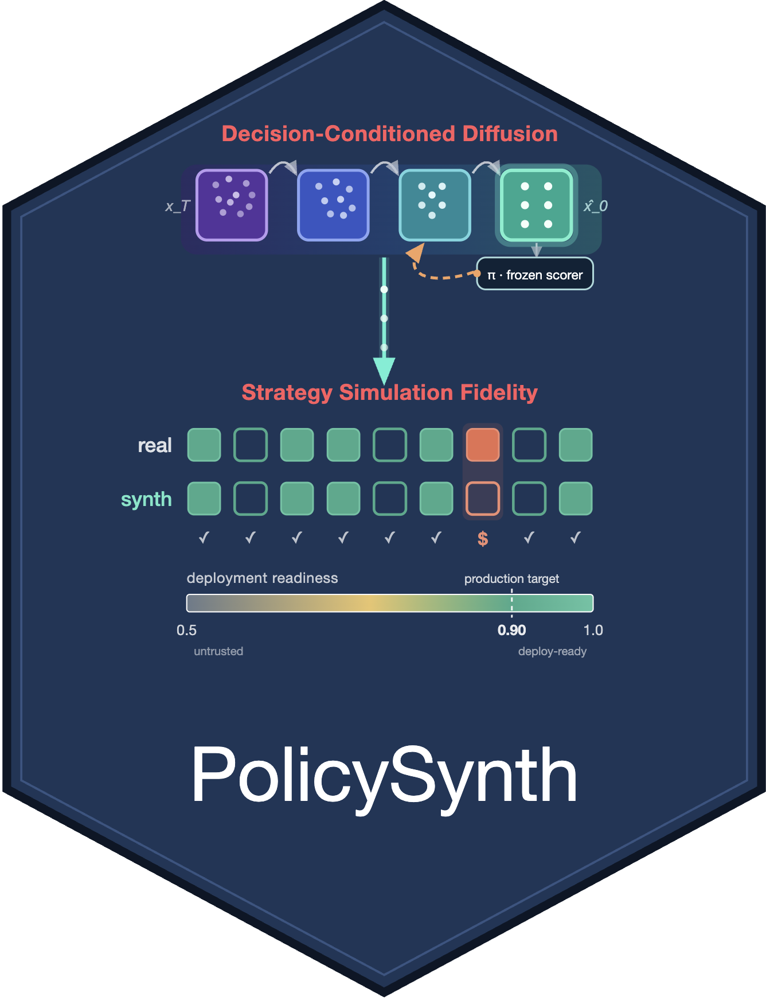

<table border="0">
  <tr>
    <td>
      
    </td>
    <td>
      <h1>PolicySynth</h1>
      <h3>Trustworthy synthetic data for campaign decision support: strategy simulation fidelity and the PolicySynth framework</h3>
    </td>
  </tr>
</table>

**Decision-aligned synthetic customer data for decision support systems.**

Synthetic data is only useful to a DSS if it leads managers to the *same
decisions* as real data would. PolicySynth is a tabular generator built for that
goal, and it ships with **Strategy Simulation Fidelity (SSF)** — a metric that
measures decision alignment directly, not distributional similarity.

---

## Install

```bash
pip install policysynth            # from PyPI (once released)
# or, from a clone:
git clone https://github.com/tungdang/policysynth && cd policysynth
pip install -e .                   # add [dev] for tests, [examples] for plots
```

Requires Python ≥ 3.9. Pulls in `numpy`, `pandas`, `scikit-learn`, `torch`.

## 30-second example

```python
from policysynth import PolicySynth, ssf_score, three_axis_report, load_telco_sample
from sklearn.model_selection import train_test_split

df = load_telco_sample()                      # bundled 7,043-row public sample
train, holdout = train_test_split(df, test_size=0.3, stratify=df["Churn"])

# 1. fit + sample a synthetic population
gen = PolicySynth().fit(train, target="Churn", value="MonthlyCharges")
synth = gen.sample(len(train))

# 2. does synthetic data drive the SAME campaign decisions as real data?
result = ssf_score(train, synth, scorer=my_churn_model, value_col="MonthlyCharges")
print(result["ssf"])                          # 1.0 == identical go/no-go decisions

# 3. is it safe to deploy? (privacy + novelty gate)
print(three_axis_report(train, synth, holdout)["passes_privacy"])
```

Or run the whole pipeline end to end:

```bash
python examples/quickstart.py
```

## Applying it to *your* data

Nothing in PolicySynth is specific to the Telco sample. The swaps:

| Tutorial | Your project |
|---|---|
| `load_telco_sample()` | your own `pandas.DataFrame` |
| `target="Churn"` | your binary decision/outcome column |
| `value="MonthlyCharges"` | your customer-value / CLV column |
| the demo scorer | your **production** churn/response model (pass it to `ssf_score`) |

`PolicySynth.fit` auto-detects categorical vs. numeric columns; override with
`categorical=[...] / numeric=[...]` if needed.

## What SSF actually measures

For a family of parameterised campaign strategies, SSF is the fraction on which
the synthetic and real populations produce the **same go/no-go decision**
(expected ROI > 0):

```
SSF = (1/K) · Σ_k  1[ decision_real(k) == decision_synth(k) ]
```

SSF = 1.0 means a manager doing what-if analysis on the synthetic data makes
exactly the decisions they'd make on real data. It is **generator-agnostic** —
score PolicySynth *or any other synthesizer* with it.

See [`docs/strategy_simulation_fidelity.md`](docs/strategy_simulation_fidelity.md)
for the full definition, the ROI value function, and how to configure the
strategy family and campaign economics for your business.

## Honest scope (please read before deploying)

- **Directional, not magnitude.** PolicySynth reliably tells you *which*
  campaigns to launch (go/no-go), but its ROI *magnitude* estimates diverge from
  real outcomes by ~70–80%. Use it for ranking/screening; apply the documented
  volume-correction before budgeted cost-benefit analysis.
- **SSF must straddle the decision boundary to be informative.** If every
  strategy is trivially profitable (or trivially unprofitable) under your
  economics, SSF is 1.0 for *any* synthetic data and tells you nothing. Tune
  `ROIConfig` so strategies fall on both sides of ROI = 0 (the quickstart does
  this and warns you if they don't).
- **The tiered-DP option is an operational governance pattern, not a formal
  (ε, δ) guarantee.** Do not rely on it for a regulatory privacy claim without
  proper DP-SGD accounting.

## API at a glance

| Symbol | Purpose |
|---|---|
| `PolicySynth` / `PolicySynthConfig` | the generator and its knobs |
| `ssf_score(...)` | Strategy Simulation Fidelity between two populations |
| `Strategy`, `ROIConfig`, `default_strategy_family()` | configure the strategy grid + economics |
| `three_axis_report(...)` | privacy (MIA-AUC) + novelty deployment gate |
| `membership_inference_auc`, `novelty_rate` | the two privacy axes, individually |
| `load_telco_sample()` | bundled demo data |

## Repository layout

```
src/policysynth/     the installable library
  ├─ generator.py    PolicySynth (conditional diffusion + A2/A3/A4)
  ├─ ssf.py          Strategy Simulation Fidelity
  ├─ evaluate.py     membership-inference + novelty gate
  ├─ data.py         generic tabular encoder/decoder
  └─ datasets/       bundled sample data + load_telco_sample()
examples/quickstart.py
tests/test_smoke.py
docs/
```

## Cite

If you use PolicySynth or SSF, please cite the paper (see
[`CITATION.cff`](CITATION.cff)).

## License

MIT — see [`LICENSE`](LICENSE).
